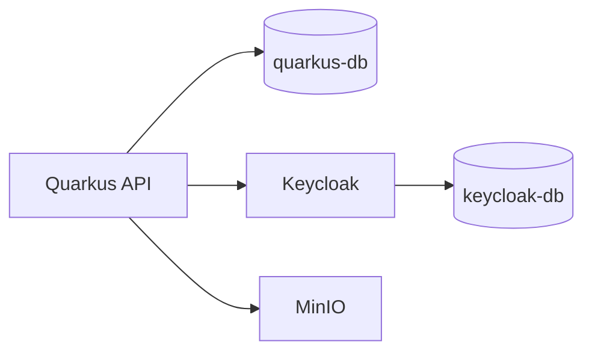

# TID Issuer Infrastructure (Docker Compose)

Infrastructure stack used by the API and frontend.

## Services

- `quarkus-db` (PostgreSQL for API)
- `keycloak-db` (PostgreSQL for Keycloak)
- `keycloak` (OIDC provider)
- `minio` (object storage)



## How To Run

1. Create env file:

```bash
cp .env.example .env
```

2. Start:

```bash
docker compose up -d
```

3. Stop:

```bash
docker compose down
```

## Exposed Ports

- `5432` -> API PostgreSQL
- `5433` -> Keycloak PostgreSQL
- `8180` -> Keycloak
- `9000` -> MinIO API
- `9001` -> MinIO Console

## Realm Bootstrap

`realm-export.json` is mounted and imported by Keycloak on startup.

## Notes

- Keep real secrets in `.env`, not in git.
- `.env.example` is the template committed to repository.
